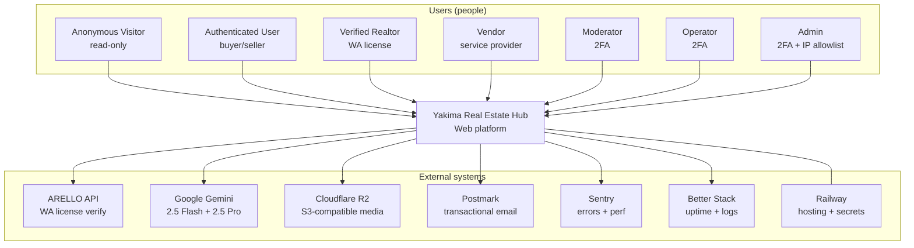
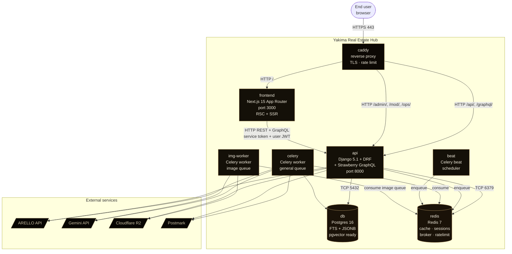
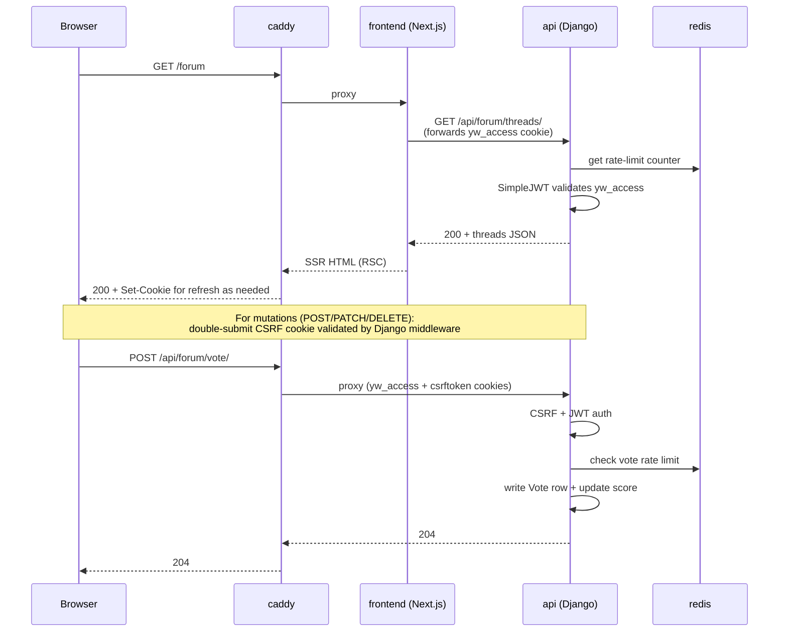
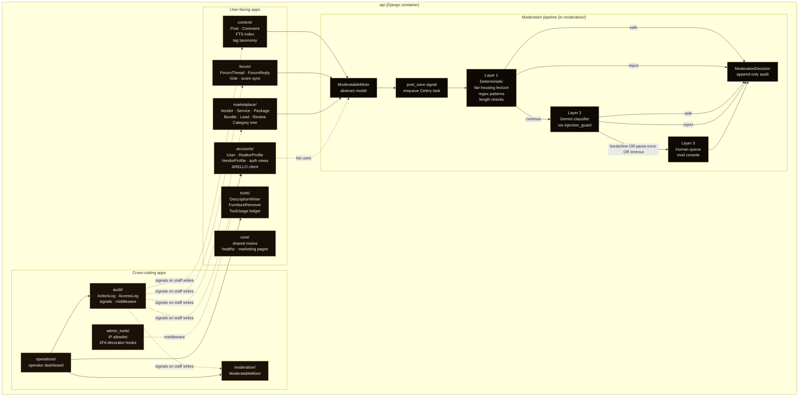
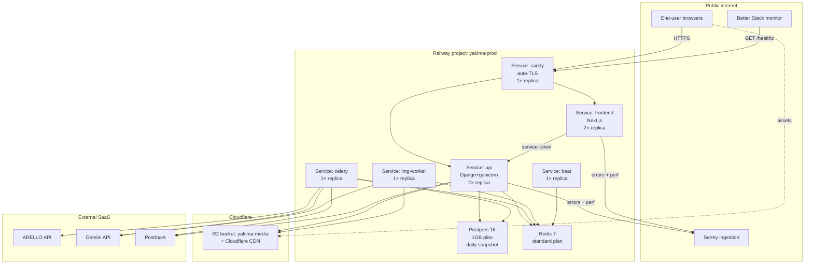
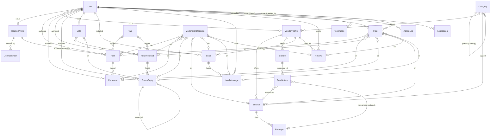

# Software Architecture Document — Yakima Real Estate Hub

| Field | Value |
|---|---|
| Document | SAD (C4-flavored, ISO 25010 quality attributes) |
| Version | 1.0 |
| Date | 2026-05-03 |
| Owner | Yakima Real Estate Hub Engineering |
| Status | Baseline for Phases 2–8 |

## Document Control

### Change Log

| Version | Date | Author | Change |
|---|---|---|---|
| 1.0 | 2026-05-03 | Engineering | Initial baseline; reflects ADR-0005 split-monolith and ADR-0006 JWT-cookie auth |

### References

- `docs/VISION-AND-SCOPE.md` — product scope
- `docs/SRS.md` — functional + non-functional requirements
- `docs/ICD.md` — interface control document (referenced)
- `docs/RISK-REGISTER.md` — risks (referenced)
- `docs/STATE-OF-THE-PROJECT.md` — sprint plan
- `docs/RUNBOOK.md` — ops procedures
- `docs/adr/0001-django-monolith.md` — original monolith decision
- `docs/adr/0002-arello-for-license-verification.md` — license trust layer
- `docs/adr/0003-gemini-as-ai-provider.md` — AI provider lock
- `docs/adr/0004-lead-gen-only-marketplace-v1.md` — marketplace payment exclusion
- `docs/adr/0005-split-monolith-django-api-nextjs-frontend.md` — transport split (frontend/api separation)
- `docs/adr/0006-jwt-cookie-auth.md` — JWT in httpOnly cookies
- `docs/adr/0007-graphql-readonly-discovery.md` — Strawberry GraphQL read-only layer
- `docs/adr/0008-cloudflare-r2-media.md` — media storage
- `docs/adr/0009-postmark-transactional-email.md` — transactional email
- `docs/research/design-system-reference.md` — vrov-new design tokens
- `docs/research/ai-moderation-prompt-injection.md` — pipeline reference
- `docs/research/arello-api-notes.md` — ARELLO contract

---

## 1. Architectural Goals & Constraints

### 1.1 Drivers (in priority order)

1. **Safety** — pipeline never approves an attack; staff actions audit-trailed; license verification is auditable.
2. **Quality bar** — visual + perf + a11y match the editorial target (`design-system-reference.md`).
3. **10K MAU baseline / 100K MAU schema-readiness** — current scale + future-proof.
4. **Solo-developer operability** — small surface, clear boundaries, low ops burden.
5. **Cost discipline** — < $200/mo total infra at 10K MAU.

### 1.2 Quality attribute scenarios (high-level)

| Driver | Scenario | Response | Measure |
|---|---|---|---|
| Performance | 1K concurrent users at peak | API responds without 5xx, p95 TTFB | < 200ms cached, < 500ms uncached |
| Security | Adversarial prompt injection in user input | Pipeline routes to human queue | 0 attacks auto-approved |
| Availability | Single Railway service goes down | Auto-restart and health-check | Recovery within 60s |
| Maintainability | New contributor needs to add an endpoint | OpenAPI auto-generated, linters green | < 2h to ship a CRUD endpoint |
| Testability | Adding a new UGC type | Inherits ModeratableMixin | Pipeline tests cover automatically |
| Modifiability | New AI tool added | Drop into `apps/tools/` with Celery task | No core architectural change |

### 1.3 Constraints (inherited)

- Stack lock per `CLAUDE.md` §"Stack" and ADRs 0001–0009.
- Hosting: Railway production; docker compose locally.
- Single Postgres, single Redis (no clustering in v1).
- No Kubernetes.
- 10K MAU baseline.
- Solo-developer operability.

---

## 2. C4 Level 1 — System Context Diagram

Yakima Real Estate Hub at center; people who use it; external systems it depends on.



**Legend.** Solid arrow = synchronous or asynchronous call from source to target. Dashed line to Railway = hosting/deployment relationship.

---

## 3. C4 Level 2 — Container Diagram

Eight services in docker compose / eight Railway services in production.



### 3.1 Container responsibilities

| Container | Tech | Responsibility |
|---|---|---|
| caddy | Caddy 2 | TLS termination (Let's Encrypt), reverse proxy, edge rate limit, request log |
| frontend | Next.js 15, React 19, TypeScript, Tailwind 3.4, Framer Motion 11, TanStack Query | SSR/RSC public pages, auth-gated client islands, marketplace search facets, AI tool flows |
| api | Django 5.1, DRF, SimpleJWT, drf-spectacular, Strawberry GraphQL | REST endpoints, GraphQL read-only, admin, mod console, ops dashboard, signal-driven audit |
| db | Postgres 16 | Source of truth; FTS via tsvector + GIN; pgvector extension installed (columns reserved) |
| redis | Redis 7 | Cache (1d TTL view cache), session fallback, Celery broker, rate-limit counters |
| celery | Celery worker (general queue) | Moderation pipeline, ARELLO calls, transactional email send, score recompute |
| beat | Celery beat | Periodic: score recompute (5m), AI spend aggregate (15m), op-dashboard refresh (5m), backup verify (1d) |
| img-worker | Celery worker (image queue) | Pillow ops, Gemini multimodal (furniture remover), R2 uploads |

### 3.2 Why a separate img-worker

Pillow + multimodal Gemini calls hold large memory and stall general-queue tasks. Isolation gives the general queue p95 enqueue→consume <2s while the image queue runs at <90s p95.

### 3.3 Auth flow across containers



### 3.4 Token lifecycle

| Token | Storage | Lifetime | Rotation |
|---|---|---|---|
| `yw_access` | httpOnly + SameSite=Strict + Secure cookie | 15 min | Silent refresh on 401 from `/api/auth/refresh/` |
| `yw_refresh` | httpOnly + SameSite=Strict + Secure cookie, Path=/api/auth/refresh/ | 7 days | Rotated on each refresh; old token denylisted |
| `csrftoken` | non-httpOnly + SameSite=Strict cookie | session | Re-issued on login |

Next.js middleware validates `yw_access` server-side before rendering RSC for auth-gated routes. Public routes render without auth check.

---

## 4. C4 Level 3 — Component Diagram (api container)

Inside the Django `api` container, organized by app boundary. The moderation pipeline is expanded.



### 4.1 Pipeline failure-mode invariants

The pipeline must never approve a parse-failure or unexpected-schema response from Gemini. Implementation:

```
Layer 2 outcome state machine:
  Gemini OK + parse OK + classification ∈ {safe, borderline, violating} → use classification
  Gemini OK + parse FAIL                                                 → human queue
  Gemini OK + classification ∉ allowed set                               → human queue
  Gemini timeout / 5xx / network error                                   → human queue (with retry)
  Layer 1 deterministic reject                                           → reject (Layer 2 not invoked)
```

`injection_guard.parse_classifier_response` enforces this. Adversarial fixtures in `apps/moderation/tests/fixtures/prompt_injection_attacks.json` exercise each branch.

### 4.2 Audit signal coverage

`apps/audit/signals.py` registers `post_save` and `post_delete` listeners on every model where `is_staff` writes are possible. The handler reads `request_local.actor` (set by middleware) and writes `ActionLog` with truncated diff. Bypassing via `Model.objects.update()` skips signals — engineering rule (§ "Conventions" in CLAUDE.md) forbids it.

---

## 5. Quality Attributes

Concrete scenarios with measurable response.

### 5.1 Performance

| Scenario | Stimulus | Response | Measure |
|---|---|---|---|
| Public post detail at peak | 1K concurrent anon users hit `/posts/<slug>` | API serves cached JSON; Caddy edge cache hits | p95 TTFB < 200ms; cache hit ≥ 80% |
| Authenticated forum vote | 60 votes/min/user steady | Redis token bucket; vote written; score denormalized | p95 < 150ms |
| Marketplace search | 100 concurrent queries against 1K-service corpus | Postgres FTS + ranking; no N+1 | p95 < 400ms |
| Furniture-remover run | User uploads 10MB photo | Img-worker processes, returns signed URL | p95 < 90s |
| List endpoint with filters | 50 concurrent | DRF paginated; ≤12 queries via select_related | p95 < 250ms |

### 5.2 Security

| Scenario | Stimulus | Response | Measure |
|---|---|---|---|
| Prompt-injection in user comment | Adversarial fixture submitted | Pipeline routes to human queue | 0 auto-approvals |
| Stolen session cookie | Attacker has `yw_access` from XSS attempt | XSS prevented by CSP+sanitize+httpOnly | No JS-readable token; CSRF stops state change |
| Admin endpoint probe from unknown IP | `GET /admin/` from non-allowlisted IP | Middleware returns 404 | No info disclosure |
| Brute-force login | 100 attempts in 1 min from one IP | django-axes lockout; Caddy rate limit | 423 Locked at 7th attempt |
| Fair-housing language in post | Phrase from protected-class lexicon | Layer 1 rejects pre-publish | Author gets reject reason |
| Unverified user attempts blog publish | POST /api/posts/ as non-realtor | Permission class denies | 403 |
| Pen-test scope | External tester runs OWASP audit | 0 High/Critical findings | Pen-test report Sprint 7 |

### 5.3 Availability

| Scenario | Stimulus | Response | Measure |
|---|---|---|---|
| api process crashes | OOM or panic | Railway auto-restarts; health check resumes | < 60s downtime |
| ARELLO unreachable | 5xx for 10 min | License-verify returns "temporarily unavailable, retry"; no 5xx to user | Non-realtor flows unaffected |
| Postgres briefly unavailable | 30s blip | API returns 503 on `/healthz`; load balancer retries | Recovery on resume |
| Gemini quota exceeded | Daily cap hit | Tools return 503 with friendly message; FR-507 | Surface before pipeline path |
| Disk near full on db | Postgres warns at 80% | Better Stack alert; ops resizes volume | < 4h to remediate |

### 5.4 Modifiability

| Scenario | Stimulus | Response | Measure |
|---|---|---|---|
| Add a new UGC type | Engineer ships `ContestEntry` model | Inherits `ModeratableMixin`; tests cover pipeline | < 1d effort |
| Replace AI provider | Migrate from Gemini to Claude | Single SDK abstraction in `apps/tools/services/llm.py` | < 3d effort |
| Add a new marketplace category | Operator adds row in admin | UI updates without deploy | Immediate |
| Change OG image template | Designer ships new SVG | Beat task regenerates on next publish | < 1h |

### 5.5 Testability

| Scenario | Stimulus | Response | Measure |
|---|---|---|---|
| Pipeline regression | Engineer ships new prompt | Adversarial fixture suite gates CI | 100% pass before merge |
| New endpoint | Engineer ships new view | drf-spectacular auto-docs; CI demands ≥1 test | OpenAPI delta visible in PR |
| Auth flow change | Engineer touches login | Playwright e2e covers signup → verify → login → 2FA → logout | All green pre-merge |

---

## 6. Architectural Decisions (ADR Index)

| ADR | Title | Status |
|---|---|---|
| 0001 | Django monolith | Accepted (transport split per 0005) |
| 0002 | ARELLO for license verification | Accepted |
| 0003 | Gemini as AI provider | Accepted |
| 0004 | Lead-gen-only marketplace v1 | Accepted |
| 0005 | Split monolith — Django api + Next.js frontend | Accepted (supersedes 0001 transport) |
| 0006 | JWT in httpOnly cookies | Accepted |
| 0007 | Strawberry GraphQL read-only discovery | Accepted |
| 0008 | Cloudflare R2 for media | Accepted |
| 0009 | Postmark transactional email | Accepted |

Each ADR carries: context, decision, consequences, status. Material additions or supersession require a new ADR (Conventional Commits scope `chore(adr)`).

---

## 7. Deployment View

### 7.1 Production (Railway)



### 7.2 Local development (docker compose)

Same eight services in `docker-compose.yml`. Differences from prod:

- Caddy uses self-signed local TLS or plaintext on localhost.
- Postgres + Redis exposed on host ports for inspection.
- `frontend` runs `next dev`; `api` runs `runserver`; both with hot reload.
- `mailhog` substitutes Postmark for local email capture.
- ARELLO and Gemini hit a `vcr.py` cassette layer when `MOCK_EXTERNAL=1`.

### 7.3 Environments

| Env | Purpose | URL pattern | Data |
|---|---|---|---|
| local | Dev | `localhost:8443` (caddy) | Synthetic seed via `manage.py seed_dev` |
| staging | Pre-launch QA, security review, pen-test | `staging.yakima.example` | Anonymized prod snapshot weekly |
| production | Public | `yakima.example` (TBD) | Live |

### 7.4 Secrets boundary

| Secret | Stored in | Rotated |
|---|---|---|
| `DJANGO_SECRET_KEY` | Railway secret | On compromise |
| `DATABASE_URL` | Railway secret (managed) | Auto |
| `REDIS_URL` | Railway secret (managed) | Auto |
| `GEMINI_API_KEY` | Railway secret | Quarterly |
| `ARELLO_API_KEY` | Railway secret | Per ARELLO contract |
| `R2_ACCESS_KEY_ID` / `R2_SECRET_ACCESS_KEY` | Railway secret | Quarterly |
| `POSTMARK_SERVER_TOKEN` | Railway secret | On compromise |
| `SENTRY_DSN` | Railway env | Per project rotate |
| `BETTER_STACK_TOKEN` | Railway env | Per project rotate |
| `ADMIN_IP_ALLOWLIST` | Railway env | On operator IP change |
| `INTERNAL_SERVICE_TOKEN` (frontend↔api) | Railway secret | Quarterly |

Secrets never enter the repo. `django-environ` reads `os.environ`. `.env.example` documents every key with placeholder values. Pre-commit `gitleaks` scan blocks accidental commits.

---

## 8. Data View

### 8.1 High-level ERD

Relationships only; no field-level detail (see migrations + models for that).



### 8.2 Key data invariants

- `LicenseCheck` is append-only. Every ARELLO call produces a row even on negative outcomes. (Safety contract #2.)
- `ModerationDecision` is append-only. Each pipeline run + each human action writes a row. (Safety contract #1.)
- `ActionLog` and `AccessLog` are append-only. (Safety contract #3.)
- `Vote` is unique on `(user, target_type, target_id)`.
- `Review` is unique on `(user, vendor, lead)`.
- `Flag` is unique on `(user, target_type, target_id)`; flagging twice is a no-op.

### 8.3 Index plan (high-level)

| Table | Indexes |
|---|---|
| post | (status, published_at desc), GIN on `tsvector(title, body)` |
| forum_thread | (status, score_cache desc), GIN on `tsvector(title, body)`, (flair, created_at desc) |
| forum_reply | (thread_id, created_at), (parent_id) |
| vote | unique (user, target_type, target_id) |
| comment | (post_id, status, created_at) |
| service | (vendor_id, status), GIN on `tsvector(title, description)` |
| lead | (vendor_id, status, created_at desc), (initiator_id, created_at desc) |
| moderation_decision | (target_type, target_id, created_at desc), (outcome, created_at desc) |
| action_log | (actor_id, created_at desc), (target_type, target_id) |
| access_log | (actor_id, created_at desc) — partition monthly at 100K MAU |
| tool_usage | (user_id, created_at desc), (tool, created_at desc) |

### 8.4 pgvector reservation

Columns reserved on `post`, `forum_thread`, `service`:

```sql
ALTER TABLE post ADD COLUMN embedding vector(768);  -- NULL until Phase 9+
```

No HNSW index until activation. Migration recorded but no semantic-search code paths in v1.

### 8.5 Time zone

All timestamps stored UTC. Display layer converts to America/Los_Angeles. Per-user time-zone preference deferred to v2.

---

## 9. Cross-cutting Concerns

### 9.1 Logging

- **Application logs.** Structured JSON to stdout. Better Stack tail.
- **Access logs.** Caddy access log → Better Stack drain. PII (cookies, tokens) redacted at log emit.
- **Audit logs.** `ActionLog` and `AccessLog` in Postgres (not stdout) for query-ability and append-only guarantee.
- **Sentry breadcrumbs.** Disabled for sensitive endpoints (auth, payment-shaped flows).

### 9.2 Monitoring

- **Errors.** Sentry — both api (Django SDK) and frontend (Next.js SDK). Source maps uploaded on deploy.
- **Performance.** Sentry Performance + Lighthouse-CI nightly on production.
- **Uptime.** Better Stack heartbeat to `/healthz` every 60s.
- **Custom metrics.** Operator dashboard surfaces internal metrics (mod queue depth/age, AI spend, MAU, NPS) computed in Celery beat tasks.

### 9.3 Feature flags

- `django-waffle` for runtime flags; flag names prefixed by phase (`p3_furniture_v2`).
- Defaults to `off` in prod for new features; flipped on per cohort.

### 9.4 Secrets

See §7.4. Never logged, never in OpenAPI, never in Sentry breadcrumbs.

### 9.5 i18n

`LANGUAGE_CODE = en-us`; no `gettext` wraps in v1 templates. v2 may add Spanish (large LatAm population in Yakima Valley).

### 9.6 Time zone

`TIME_ZONE = America/Los_Angeles`. Display only — storage UTC. `USE_TZ = True`.

### 9.7 Configuration

`django-environ` reads `.env`. Settings split: `config/settings/{base.py, dev.py, prod.py}`. `DJANGO_SETTINGS_MODULE` selects.

### 9.8 Background jobs

Celery 5+, Redis broker. Queues: `default`, `image`, `email`. Beat schedule defined in code (`config/celery.py`), not DB-driven.

### 9.9 Caching

Redis cache for view caching (anonymous responses, 60s s-maxage). Caddy edge cache adds another layer. Per-user data not cached.

---

## 10. Technology Choices

| Concern | Choice | ADR |
|---|---|---|
| Backend framework | Django 5.1 | 0001 |
| API style | DRF + drf-spectacular OpenAPI | 0001 (impl) |
| GraphQL | Strawberry (read-only) | 0007 |
| Auth | SimpleJWT + django-allauth + django-otp + django-axes | 0006 |
| Frontend | Next.js 15 App Router, React 19 RSC, TypeScript | 0005 |
| Styling | Tailwind 3.4, vrov-new tokens | `design-system-reference.md` |
| Animation | Framer Motion 11 (frontend), Motion One + Alpine (legacy templated views) | `design-system-reference.md` |
| Async | Celery 5 + Redis broker | 0001 |
| Database | Postgres 16, FTS, JSONB, pgvector ready | 0001 |
| Cache / sessions / broker / ratelimit | Redis 7 | 0001 |
| AI | Gemini 2.5 Flash (moderation) + 2.5 Pro (tools) | 0003 |
| License verify | ARELLO REST | 0002 |
| Storage | Cloudflare R2 + CDN | 0008 |
| Email | Postmark via django-anymail | 0009 |
| Reverse proxy / TLS | Caddy 2 | infra default |
| Hosting | Railway (Fly.io alternate) | 0001 §11 |
| Errors | Sentry | infra default |
| Uptime / logs | Better Stack | infra default |
| E2E tests | Playwright | `superpowers:test-driven-development` |
| Unit tests | pytest (backend), Vitest (frontend) | infra default |
| CI | GitHub Actions | infra default |
| Linting | ruff (Python), eslint+prettier (TS), djlint (templates) | `CLAUDE.md` |
| Typing | mypy strict on critical apps | `CLAUDE.md` |

---

## 11. Risks & Mitigations

Full risk register lives in `docs/RISK-REGISTER.md`. Top architectural risks summarized:

| Risk | Likelihood | Impact | Mitigation |
|---|---|---|---|
| ARELLO API change/outage | Medium | High (realtor onboarding blocks) | VCR tests + graceful fallback (FR-307); ADR-0002 alternate plan |
| Gemini cost overrun | Medium | High (budget) | Per-user cap (FR-505) + global daily cap (FR-507); Sentry alert |
| Pipeline false-negative | Low | Critical (Fair Housing exposure) | Adversarial fixtures gate CI (FR-607); fail closed (FR-608) |
| Vendor account abuse | Medium | Medium | Identity attestation + manual operator approval; mod-queue surface |
| Solo-developer bus factor | High | High | ADRs, runbook, per-phase plans, `CLAUDE.md` onboarding |
| Schema lock-in (no MLS now, partner pressure later) | Medium | Medium | pgvector + JSONB headroom; clear v2 backlog |
| Railway pricing change | Low | Medium | Fly.io alternate documented; 12-factor portability |
| Pen-test High/Critical at Sprint 7 | Medium | High (delays launch) | Internal `security-review` end of every phase; OWASP Top 10 hardening throughout |

---

## 12. Architectural Evolution

### 12.1 Deferred (v2+ candidates)

- **MLS / IDX integration.** Requires sponsoring brokerage; data licensing negotiation; significant schema additions (Listing, ListingHistory). Hosting tier upgrade likely.
- **Stripe Connect / payments.** Marketplace transaction layer. 1099-K reporting, dispute handling, PCI scope (SAQ-A at minimum). New ADR superseding 0004.
- **Multi-region (Tri-Cities, Wenatchee).** Content taxonomy refactor; per-region SEO; per-region operator delegation.
- **Native mobile apps.** Once mobile web has product-market fit and ≥50K MAU.
- **Multi-language (Spanish).** Wraps `gettext`, locale-aware URL routing.
- **Semantic search / pgvector activation.** Embed posts and threads; cosine-similarity recommendation. Schema-ready already (NFR-703).
- **User-to-user direct messaging.** Out of v1 scope; if added, gets its own moderation pipe and rate-limit profile.
- **Live audio / video features (e.g., realtor AMAs).** Embed-only in v1; first-party streaming would require substantial infra additions.
- **Partner content syndication.** GraphQL read-only layer (ADR-0007) is the seed; full partner-API program is post-launch.
- **Native iOS/Android push notifications.** Web Push notifications (PWA) before native.

### 12.2 Architectural simplifications retained

- No microservices. Split monolith only — frontend/api boundary serves the actual customer (browser SSR + hydration); further splits buy nothing at 10K MAU.
- No Kubernetes. Railway services + worker replicas suffice.
- No in-house ML. Gemini-managed. pgvector reserved for retrieval; no custom embedding pipelines.
- No multi-DB. Single Postgres; if read load demands, add replicas before sharding.

### 12.3 Triggers for re-architecture

| Trigger | Likely change |
|---|---|
| MAU > 50K sustained | Add Postgres read replica; promote img-worker to 2× replica |
| Gemini latency p95 > 30s | Switch to async-by-design UI for tools; queue UX redesign |
| Mod queue depth > 200 sustained | Add a 2nd moderator role + workload routing in mod console |
| Pen-test High finding in production | Hot-fix + ADR + post-mortem |
| Railway region outage > 4h | Failover to Fly.io documented in `RUNBOOK.md` |

---

## 13. Document Conventions

- All Mermaid diagrams render in GitHub and the Next.js docs view (mdx-mermaid).
- Cross-references use `see SAD.md §3.2` form.
- Concrete file paths are absolute repo-relative (e.g., `apps/moderation/services/pipeline.py`).
- Material updates trigger a version bump and Change Log entry.
- ADRs are the authoritative source for any decision summarized here; SAD reflects their conclusions, not their full reasoning.
