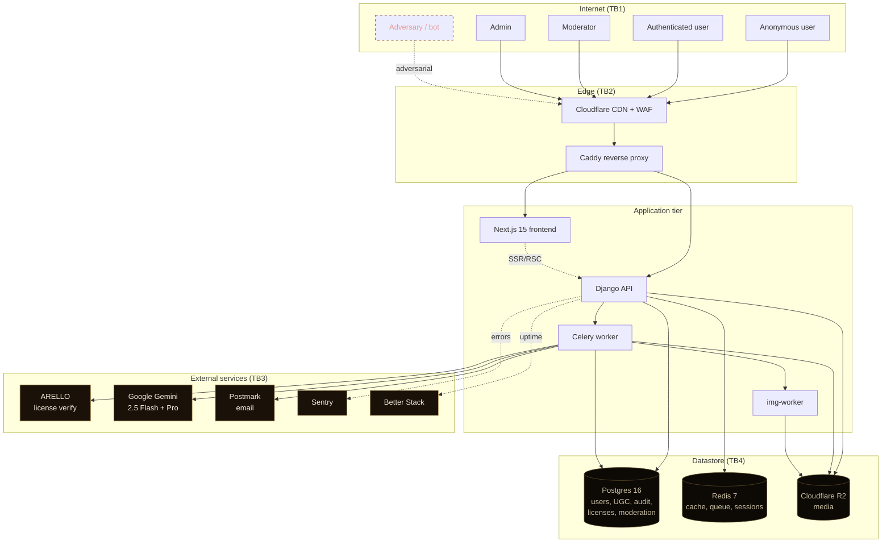
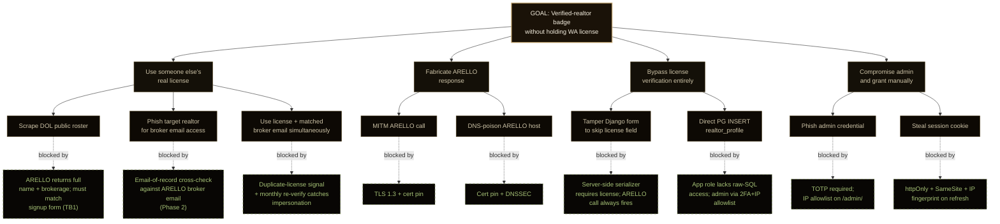

# Threat Model — Yakima Real Estate Hub

## Document control

| Field | Value |
|---|---|
| Version | 1.0 |
| Date | 2026-05-03 |
| Owner | Yakima Real Estate Hub Security |
| Methodology | STRIDE + DFD + attack trees |
| Classification | Internal |
| Review cadence | Every 6 months OR on architecture change |
| Cross-references | `docs/RISK-REGISTER.md`, `docs/SECURITY-PLAYBOOK.md`, `docs/SRS.md`, `docs/SAD.md`, `docs/ICD.md`, `docs/MTP.md` |

## 1. Scope

In scope:

- Application layer: Django REST API, Next.js frontend, Caddy reverse proxy, Celery worker, img-worker.
- Data layer: Postgres 16, Redis 7, Cloudflare R2.
- Auth subsystem: SimpleJWT, django-allauth, django-otp, django-axes.
- Moderation subsystem: 3-layer pipeline, Gemini integration, prompt-injection guard.
- Audit subsystem: ActionLog, AccessLog, signals, middleware.
- External integrations: ARELLO, Gemini, Postmark, R2, Sentry, Better Stack.
- All UGC pipes: comments, blog posts, forum threads/replies, vendor service descriptions, reviews, AI tool inputs/outputs.

Out of scope:

- Physical security of Railway, Cloudflare, ARELLO, Google Cloud data centers (vendor responsibility).
- Endpoint security of Yakima realtors' personal devices.
- Social engineering against ARELLO/DOL personnel.
- Side-channel attacks on shared cloud CPUs (deferred — no realistic mitigation at our scale).
- State-actor APT targeting (low likelihood, accepted).
- Supply-chain attacks beyond standard pin-and-audit hygiene (full SLSA-3 deferred to v2).

## 2. Asset inventory

| Asset ID | Asset | Sensitivity | Storage | Encryption at rest | Encryption in transit |
|---|---|---|---|---|---|
| A-01 | User passwords (Argon2id hashes) | High | Postgres `auth_user.password` | yes (PG TDE) | TLS 1.3 |
| A-02 | MFA secrets (TOTP) | High | Postgres `otp_totp_totpdevice.key` | yes (Fernet field encryption) | TLS 1.3 |
| A-03 | JWT signing key | Critical | Railway env var, in-memory | yes (Railway secrets) | n/a |
| A-04 | JWT access tokens | Medium (15min TTL) | Browser httpOnly cookie | n/a | TLS 1.3 + cookie Secure flag |
| A-05 | JWT refresh tokens | High (7d TTL) | Browser httpOnly cookie + DB blacklist | TLS in transit, cookie Secure | TLS 1.3 |
| A-06 | User PII (email, name, IP) | High | Postgres | PG TDE | TLS 1.3 |
| A-07 | WA license number + raw ARELLO JSON | High | Postgres `accounts_licensecheck` | PG TDE | TLS 1.3 |
| A-08 | UGC content (forum, comments, posts) | Medium-High (some private/draft) | Postgres + R2 attachments | PG TDE | TLS 1.3 |
| A-09 | Audit log (ActionLog/AccessLog) | Critical (immutable) | Postgres, no-DELETE policy | PG TDE | TLS 1.3 |
| A-10 | Moderation decisions + flagged-content cache | High | Postgres | PG TDE | TLS 1.3 |
| A-11 | AI tool inputs (uploaded property photos) | Medium-High (private to user) | Cloudflare R2 | R2 SSE | TLS 1.3 |
| A-12 | AI tool outputs (processed photos, AI text) | Medium | Cloudflare R2 + PG | R2 SSE + PG TDE | TLS 1.3 |
| A-13 | Operational secrets (DB creds, API keys) | Critical | Railway secrets | Railway-managed | n/a |
| A-14 | Postmark API token | High | Railway env | Railway-managed | n/a |
| A-15 | Vendor business data | Medium | Postgres | PG TDE | TLS 1.3 |
| A-16 | Lead records | Medium | Postgres | PG TDE | TLS 1.3 |
| A-17 | Sentry/Better Stack credentials | Medium | Railway env | Railway-managed | n/a |

## 3. Trust boundaries

| TB | Boundary | Crosses |
|---|---|---|
| TB1 | Internet → Edge (Caddy) | All HTTP requests; threats: DDoS, scrape, scan |
| TB2 | Edge (Caddy) → App (Django/Next) | Authenticated and unauthenticated requests after rate-limit; threats: header injection, oversize body |
| TB3 | App → External services (ARELLO, Gemini, Postmark, R2) | Outbound HTTPS; threats: SSRF if user-controlled URL, data exfil through prompt injection |
| TB4 | App → Datastore (Postgres, Redis) | App-to-DB connections; threats: SQLi, deserialization, unbounded reads |
| TB5 | Public (anonymous) → Authenticated user context | Login, signup, password reset; threats: cred stuffing, brute force, account takeover |
| TB6 | User → Staff role | Role escalation via /admin/, mod console; threats: privilege escalation, IDOR |
| TB7 | Web → Background worker (Celery) | Task queue; threats: malicious task payload, worker starvation |
| TB8 | App → Logs / Monitoring (Sentry, Better Stack) | Outbound; threats: PII leak in logs, log forgery |

## 4. Data flow diagram

Trust boundary annotations:

- TB1 crosses at CDN ingress.
- TB2 between Caddy and FE/API.
- TB3 anywhere App leaves to external service.
- TB4 between App and PG/Redis/R2.

## 5. STRIDE per component

Threat ID format: `T-<component>-<stride>-<n>`. Status: M=mitigated, P=partial, O=open, A=accepted.

### 5.1 Caddy reverse proxy

| Threat ID | STRIDE | Threat | Mitigation | Residual | Status |
|---|---|---|---|---|---|
| T-CADDY-S-1 | Spoof | Forged client IP via `X-Forwarded-For` | Caddy strips and re-sets XFF; only Cloudflare IPs trusted as upstream | Low | M |
| T-CADDY-T-1 | Tamper | TLS strip / downgrade | HSTS preload, TLS 1.3-only, cert via Caddy ACME | Very Low | M |
| T-CADDY-T-2 | Tamper | HTTP request smuggling | Caddy enforces RFC 7230 strict parsing | Very Low | M |
| T-CADDY-R-1 | Repudiation | Edge logs missing for incident | Caddy access logs to stdout → Railway log retention 7d → forwarded to Better Stack 30d | Low | M |
| T-CADDY-I-1 | Info disclosure | Error pages leak server version | `Server` header stripped, custom error page | Very Low | M |
| T-CADDY-D-1 | DoS | Slowloris / connection exhaustion | Caddy default timeouts 10s read / 30s write; Cloudflare upstream absorbs L4 | Low | M |
| T-CADDY-D-2 | DoS | Volumetric L7 flood | Cloudflare WAF rate limit (Sprint 2: 100req/min/IP global, tighter on auth endpoints) | Medium | P |
| T-CADDY-E-1 | Elevation | Caddy compromise → upstream pivot | Caddy runs unprivileged in container; no shared volumes with app; Caddy → upstream only via internal Docker network | Low | M |

### 5.2 Frontend (Next.js 15)

| Threat ID | STRIDE | Threat | Mitigation | Residual | Status |
|---|---|---|---|---|---|
| T-FE-S-1 | Spoof | Phishing site clone | DMARC + SPF + DKIM strict; Cloudflare brand-protection alerts; published canonical URL | Medium | P |
| T-FE-T-1 | Tamper | Stored XSS via UGC | `bleach` sanitizer on all UGC HTML at write; React JSX auto-escapes; CSP nonce policy (Sprint 2 — currently `unsafe-inline` accepted with strict-dynamic plan) | Medium | P |
| T-FE-T-2 | Tamper | Reflected XSS via query param | Next.js auto-escapes; URL params validated server-side | Low | M |
| T-FE-T-3 | Tamper | DOM-based XSS via `dangerouslySetInnerHTML` | Lint rule blocks; only used post-bleach with comment justification | Low | M |
| T-FE-T-4 | Tamper | Subresource hijack via CDN compromise | SRI hashes on all external scripts; locked Tailwind CDN URL with hash; build-time bundling | Low | M |
| T-FE-R-1 | Repudiation | User claims they didn't do an action | All mutating requests audited via API + ActionLog; cookie auth not localStorage | Low | M |
| T-FE-I-1 | Info disclosure | Sensitive data in client bundle | Build verifies no `process.env.*_SECRET` in client bundle; pre-deploy bundle scan | Very Low | M |
| T-FE-I-2 | Info disclosure | Browser cache leaks PII pages | `Cache-Control: private, no-store` on authenticated pages | Low | M |
| T-FE-D-1 | DoS | Malicious page consumes client CPU (Alpine x-init loop) | CSP nonces (Sprint 2), no `unsafe-eval`, prefers-reduced-motion respected | Low | M |
| T-FE-E-1 | Elevation | Privilege escalation via client-only role check | All authorization server-side; client role only used for UI hide/show | Very Low | M |

### 5.3 Django API

| Threat ID | STRIDE | Threat | Mitigation | Residual | Status |
|---|---|---|---|---|---|
| T-API-S-1 | Spoof | Forged JWT | `SimpleJWT` HS256 with 64B `SECRET_KEY` derivative; verify on every request; rotation on refresh | Very Low | M |
| T-API-S-2 | Spoof | CSRF on state-changing endpoint | CSRF double-submit cookie + header check; SameSite=Strict on session cookie; CORS allowlist | Low | M |
| T-API-S-3 | Spoof | Session fixation post-login | Session ID rotates on login (`request.session.cycle_key()`); JWT issued fresh | Very Low | M |
| T-API-T-1 | Tamper | SQL injection | Django ORM parameterizes; raw SQL forbidden by lint (`bandit`); migrations reviewed | Very Low | M |
| T-API-T-2 | Tamper | NoSQL injection (Redis cache key) | Redis client uses parameterized commands; cache keys constructed from validated inputs | Very Low | M |
| T-API-T-3 | Tamper | IDOR (read other user's data via `?id=`) | Per-view object permission check; `get_object_or_404(qs.filter(owner=request.user))` pattern | Low | M |
| T-API-T-4 | Tamper | Mass-assignment via DRF serializer | Serializers explicitly list `fields`; `read_only_fields` for sensitive | Low | M |
| T-API-T-5 | Tamper | File upload type spoofing | `python-magic` MIME sniff; allowlist of MIME types; size limit (Sprint 2: 10MB images, currently unbounded — risk accepted short-term) | Medium | P |
| T-API-R-1 | Repudiation | Staff write without log | `apps/audit/signals.py` post_save catches every write where user.is_staff; `objects.update()` bypass blocked by lint + code review | Low | M |
| T-API-I-1 | Info disclosure | Exception traceback in prod response | `DEBUG=False` in prod; custom error handler; Sentry captures internal | Very Low | M |
| T-API-I-2 | Info disclosure | Stack-walking via `?format=` param | DRF only enables negotiated formats; no debug renderers | Very Low | M |
| T-API-I-3 | Info disclosure | Verbose error reveals user existence | Login failure returns generic message regardless of cause | Low | M |
| T-API-I-4 | Info disclosure | Listing endpoint exposes private fields | DRF serializer field allowlist; manager-level filter on querysets | Low | M |
| T-API-D-1 | DoS | Unbounded queryset / pagination | Pagination required on list endpoints (DRF setting); max page size 100 | Low | M |
| T-API-D-2 | DoS | Expensive endpoint flood (search, AI tools) | Rate limit per user/IP (Sprint 2); Caddy upstream timeout | Medium | P |
| T-API-D-3 | DoS | Regex catastrophic backtracking | Layer-1 mod regexes vetted with `re2` patterns; user-provided regex never executed | Low | M |
| T-API-E-1 | Elevation | `@staff_member_required` bypass | Django decorator backed by `is_staff`; admin URL behind IP allowlist; tests cover all role-gated views | Very Low | M |
| T-API-E-2 | Elevation | Unsafe deserialization (pickle) | Pickle never used for untrusted input; Celery tasks use JSON serializer; sessions use signed-JSON | Very Low | M |

### 5.4 Celery worker

| Threat ID | STRIDE | Threat | Mitigation | Residual | Status |
|---|---|---|---|---|---|
| T-CW-S-1 | Spoof | Task injection via Redis | Redis bound to internal network only; `requirepass` set; ACL restricts default user | Low | M |
| T-CW-T-1 | Tamper | Task payload manipulation | JSON serializer (no pickle); task signatures schema-validated on receive | Very Low | M |
| T-CW-R-1 | Repudiation | Task ran but no record | `django-celery-results` records all task results to PG; correlation IDs in ActionLog | Low | M |
| T-CW-I-1 | Info disclosure | Task error logs PII | Sentry scrubber configured for email, license, address regexes | Low | M |
| T-CW-D-1 | DoS | Worker queue flooded | Per-task rate limits in `apps/*/tasks.py`; queue depth alert; reject new at hard cap | Medium | P |
| T-CW-E-1 | Elevation | Worker container compromise | Worker runs as non-root, read-only FS, no shell binary, drop-all caps + add-back only required | Low | M |

### 5.5 Postgres

| Threat ID | STRIDE | Threat | Mitigation | Residual | Status |
|---|---|---|---|---|---|
| T-PG-S-1 | Spoof | Connection from unauthorized client | Railway-managed PG; `pg_hba.conf` enforces TLS; app credentials in Railway secrets only | Low | M |
| T-PG-T-1 | Tamper | Audit log row deletion | DB role for app has no `DELETE` privilege on `audit_actionlog`/`audit_accesslog`; only superuser via direct PG can delete (operational use only) | Very Low | M |
| T-PG-T-2 | Tamper | Migration applied unintentionally drops data | Migration safety review checklist; staging replay before prod; `python manage.py check --deploy` warning on data-loss migrations | Low | M |
| T-PG-R-1 | Repudiation | Direct PG write without audit | Triggers on key tables (`accounts_realtorprofile`, `content_post`) emit audit row when modified outside Django ORM (Sprint 4) | Medium | O |
| T-PG-I-1 | Info disclosure | Unencrypted PII at rest | Railway PG TDE; selected fields use `django-cryptography` for double-encryption (license raw JSON, MFA secret) | Low | M |
| T-PG-I-2 | Info disclosure | Query log in monitoring contains PII | `log_statement = 'ddl'` only in prod; slow query log redacts param values | Low | M |
| T-PG-D-1 | DoS | Bad query consumes all connections | App connection pool size 50; statement_timeout 5s; pgBouncer in front | Low | M |
| T-PG-E-1 | Elevation | App role gains superuser via SQL injection chain | App role created with explicit grant list, no superuser; row-level security on sensitive tables (Sprint 4 — currently relies on app-layer filter, accepted risk) | Medium | P |

### 5.6 Redis

| Threat ID | STRIDE | Threat | Mitigation | Residual | Status |
|---|---|---|---|---|---|
| T-R-S-1 | Spoof | Unauthenticated client connects | Redis 7 ACL; app uses limited-scope user; only internal network exposed | Low | M |
| T-R-T-1 | Tamper | Cache poisoning (forge cached value) | Cache keys include user/object identity; signed payloads where authenticity matters; rate-limit counters atomic via INCR | Low | M |
| T-R-I-1 | Info disclosure | Sessions / cache leak via dump | Internal-only network; `dump`/`migrate` commands disabled via ACL; backup snapshots encrypted | Low | M |
| T-R-D-1 | DoS | Memory exhaustion via large cache values | `maxmemory` set, `allkeys-lru` eviction; per-key size cap on app side | Low | M |

### 5.7 ARELLO integration

| Threat ID | STRIDE | Threat | Mitigation | Residual | Status |
|---|---|---|---|---|---|
| T-ARELLO-S-1 | Spoof | MITM intercepts ARELLO response and lies "verified" | TLS 1.3 with cert pin to ARELLO CA; response signature TBD with vendor (none today, accepted) | Medium | A |
| T-ARELLO-T-1 | Tamper | Cache returns stale "verified" after license revoked | Monthly re-verify cron in `apps/accounts/tasks.reverify_licenses`; per-realtor 30-day TTL | Low | M |
| T-ARELLO-R-1 | Repudiation | "Why was X badged?" no record | Every call writes `LicenseCheck` with raw response JSON, request URL, timestamp, requester | Very Low | M |
| T-ARELLO-I-1 | Info disclosure | Logs contain license number | Log scrubber masks license number to last-4; raw stored encrypted | Low | M |
| T-ARELLO-D-1 | DoS | ARELLO outage blocks signups | Circuit breaker (Sprint 2); pending-state badge during outage | Medium | P |
| T-ARELLO-E-1 | Elevation | Outbound URL crafted to point to internal service (SSRF) | Endpoint URL hardcoded; no user-supplied URL component; outbound traffic goes via egress allowlist | Very Low | M |

### 5.8 Gemini integration

| Threat ID | STRIDE | Threat | Mitigation | Residual | Status |
|---|---|---|---|---|---|
| T-GEM-S-1 | Spoof | Prompt-injected payload causes classifier to lie | 3-layer pipeline; Layer 1 deterministic regex; Layer 2 schema-validated JSON output; Layer 3 human queue; `injection_guard.parse_classifier_response` fails closed on any parse anomaly | Medium | M |
| T-GEM-T-1 | Tamper | Response stream corrupted mid-flight | TLS 1.3; full-response receive before parse; retry on partial | Very Low | M |
| T-GEM-T-2 | Tamper | User uploads photo with adversarial pixels manipulating multimodal model | Layer 1 size + dimension + format check; Gemini multimodal classifier rubric explicitly resists embedded text instructions; output schema-validated | Medium | P |
| T-GEM-R-1 | Repudiation | "Why was post X approved?" | `ModerationDecision` row stores prompt, response, classification, confidence, timestamp | Very Low | M |
| T-GEM-I-1 | Info disclosure | User PII sent to Google in moderation prompt | Gemini under enterprise privacy terms (no training on inputs); PII redaction Layer 1 strips obvious PII before Layer 2 prompt | Medium | P |
| T-GEM-I-2 | Info disclosure | AI tool prompt leaks system prompt to user | System prompt is server-side only, never in response; output sanitization strips any system-prompt echo | Low | M |
| T-GEM-D-1 | DoS | Gemini outage | Circuit breaker; mod queue holds at Layer 1; AI tools display unavailable | Medium | P |
| T-GEM-D-2 | DoS | Cost runaway via abuse | Daily spend cap (Sprint 2); per-user/IP rate limit; output token cap | Medium | P |
| T-GEM-E-1 | Elevation | Prompt-injection causes classifier to instruct system action | Pipeline only ingests structured classification, never executes free-form output as instruction; output strictly typed | Low | M |

### 5.9 R2 integration

| Threat ID | STRIDE | Threat | Mitigation | Residual | Status |
|---|---|---|---|---|---|
| T-R2-S-1 | Spoof | Forged signed URL | URLs signed with R2 signing key (rotating 90d); short TTL (5min for upload, 1h for read); per-user prefix | Low | M |
| T-R2-T-1 | Tamper | Object replaced after upload | R2 versioning enabled (90d retention); mutation requires new key | Low | M |
| T-R2-R-1 | Repudiation | "Who uploaded this image?" | R2 object metadata records uploader user_id; PG `tools_aiinput` row tracks reference | Low | M |
| T-R2-I-1 | Info disclosure | Public bucket misconfig exposes private property photos | Bucket private by default; CORS allowlist; objects served only via signed URL or signed+CDN | Low | M |
| T-R2-I-2 | Info disclosure | Image EXIF leaks GPS of property | Pre-upload EXIF strip in img-worker; client-side strip on user upload (Sprint 4) | Medium | P |
| T-R2-D-1 | DoS | Upload flooding fills bucket / runs cost | Per-user upload rate limit; daily storage cap per user | Medium | P |

### 5.10 Auth subsystem

| Threat ID | STRIDE | Threat | Mitigation | Residual | Status |
|---|---|---|---|---|---|
| T-AUTH-S-1 | Spoof | Credential stuffing | django-axes 5-fail-in-5min lockout; CAPTCHA after 3 fails; HIBP check on signup + change (Sprint 3) | Medium | P |
| T-AUTH-S-2 | Spoof | Password reset hijack via email enumeration | Generic "if account exists, email sent" response; signed token in URL with 30min TTL; one-time-use enforced | Low | M |
| T-AUTH-S-3 | Spoof | TOTP replay | TOTP window narrow (1 step ±); used codes invalidated for window; rate limit on verify endpoint | Low | M |
| T-AUTH-T-1 | Tamper | Session cookie tampering | Cookies signed with `SECRET_KEY`; httpOnly + Secure + SameSite=Strict; JWT HS256 verified | Very Low | M |
| T-AUTH-R-1 | Repudiation | Login event undisputed | AccessLog records every login attempt with IP, UA, success/fail | Very Low | M |
| T-AUTH-I-1 | Info disclosure | Password leak via /api/login error | Generic error; password never logged | Very Low | M |
| T-AUTH-I-2 | Info disclosure | Account-existence oracle via signup | Signup returns generic "if available, verification sent"; timing-safe response | Low | M |
| T-AUTH-D-1 | DoS | Lockout abuse — attacker locks legit user | Lockout keyed on IP + username pair, not username alone; admin override path | Low | M |
| T-AUTH-E-1 | Elevation | Privilege escalation via tampered JWT | HS256 with strong key; algorithm pinned; `none` algorithm rejected | Very Low | M |

### 5.11 Moderation subsystem

| Threat ID | STRIDE | Threat | Mitigation | Residual | Status |
|---|---|---|---|---|---|
| T-MOD-S-1 | Spoof | Bypass pipeline by direct DB write | All UGC models inherit `ModeratableMixin`; post_save signal queues moderate task; raw SQL writes flagged in PG audit trigger (Sprint 4) | Low | M |
| T-MOD-T-1 | Tamper | Prompt injection causes Layer 2 to emit `approved` for malicious | See Prompt injection deep-dive §6.1 | Medium | M |
| T-MOD-R-1 | Repudiation | "Why was Y removed?" | `ModerationDecision` row, mod responsible, rationale, classification confidence | Very Low | M |
| T-MOD-I-1 | Info disclosure | Mod queue exposes private content to all mods | Mod role required; per-content access log; mod console behind IP allowlist (Sprint 6 — currently behind login + role only) | Medium | P |
| T-MOD-D-1 | DoS | Mod queue floods with garbage from spam | Layer 1 deterministic regex catches obvious spam at write-time; per-user submit rate limit | Low | M |
| T-MOD-E-1 | Elevation | Mod abuses powers (mass-suspend) | Per-mod rate limit on destructive actions; suspicious-pattern alert; freeze-mod operator action | Low | M |

### 5.12 Audit subsystem

| Threat ID | STRIDE | Threat | Mitigation | Residual | Status |
|---|---|---|---|---|---|
| T-AUD-S-1 | Spoof | Forged audit row attributing action to wrong user | App role can INSERT only; user_id pulled from request context, not request body; FK constraint to auth_user | Low | M |
| T-AUD-T-1 | Tamper | UPDATE/DELETE on audit table | App role lacks UPDATE+DELETE on `audit_*`; signal-emitted INSERTs only; PG-level grant proof in migration `0010_audit_immutability.py` | Very Low | M |
| T-AUD-T-2 | Tamper | Logical bypass via `objects.update()` (no signal fires) | Lint rule blocks `.update()` in app code outside `apps/audit/`; pre-commit hook scan; code review checklist | Low | M |
| T-AUD-R-1 | Repudiation | Action ran but row missing | Signal-driven, post_save guarantees fire; gap detection via daily comparator job comparing AccessLog request count vs ActionLog write count for is_staff users | Low | M |
| T-AUD-I-1 | Info disclosure | Audit row contains plaintext PII | `payload_json` field stores diff with PII redacted at signal time | Medium | P |
| T-AUD-D-1 | DoS | Audit table grows unbounded | Partitioned by month; TTL 7y for compliance, archive to R2 cold storage; index on user+timestamp | Low | M |

## 6. Deep dives

### 6.1 Prompt injection (vs moderation pipeline)

Defense-in-depth across three layers. Adversary goal: get UGC published without it being flagged.

**Layer 1 — Deterministic preprocessor** (`apps/moderation/services/layer1_deterministic.py`)

- Regex catalogue: doxxing patterns (US street + city + state + zip; phone; SSN-shaped), known scam markers, illegal-rental keywords, spam URL list.
- Bleach HTML sanitization removes scripts, on-handlers, javascript: URLs.
- Entropy / repetition heuristics catch obvious automation.
- Output: `{flag: deny | needs_layer_2 | clean, reason: ..., redactions: [...]}`.

**Layer 2 — Gemini classifier** (`apps/moderation/services/layer2_gemini.py`)

- Prompt template uses XML tags + clear instruction segregation: `<system_rules>...</system_rules>` (frozen) and `<content_to_classify>...</content_to_classify>` (untrusted).
- Output schema enforced: `{classification: approve | reject | escalate, confidence: 0.0-1.0, rationale: <=200 chars, categories: [...]}`.
- `injection_guard.parse_classifier_response`:
  - Strips any pre-JSON text.
  - Validates against JSON schema (Pydantic model).
  - Rejects responses with rationale containing instruction-shaped strings ("ignore", "system", "bypass", "approved by").
  - Confidence < 0.6 forces escalate.
  - Any parse exception → escalate (fail closed).
- Decision: `escalate` → Layer 3.

**Layer 3 — Human queue** (`apps/moderation/services/layer3_queue.py`)

- All `escalate` items land in mod console with full context: original content, Layer 1 output, Layer 2 prompt + raw response + parsed classification.
- Mod decision recorded in `ModerationDecision`.
- Until decided, content is `pending_review` (visible only to author, with banner).

**Adversarial fixture corpus** (`apps/moderation/tests/fixtures/prompt_injection_attacks.json`)

- 30+ payloads covering: classic instruction overrides, role-play jailbreaks, encoded payloads (Base64, Unicode tricks), nested-language injection, multimodal injection (image with embedded text), system-prompt extraction, indirect injection via included URLs, OWASP LLM top-10 cases.
- Test contract: any payload classified as `approve` is a regression. CI fails build.
- 5+ new fixtures per phase target.

**Failure modes that remain (residual)**

- Novel zero-day prompt-injection technique not yet captured. Mitigation: Layer 3 catches escalations; periodic adversarial review (`gsd-secure-phase`).
- Multimodal injection via image more brittle than text. Mitigation: tighter image preprocessing (planned Sprint 4); user-uploaded photos for AI tools route through separate quarantine pipeline.

### 6.2 License-fraud (vs ARELLO + audit)

Adversary goal: obtain verified-realtor badge under a license they don't hold.

**Defenses**

1. **ARELLO as authoritative** — license number + legal name + brokerage name + status all returned; we require all four to match user-submitted form. License number alone insufficient.
2. **Email-of-record cross-check** — Phase 2 will require user to confirm via email sent to the broker email listed in ARELLO response.
3. **Duplicate-license signal** — `apps/accounts/signals.duplicate_license_check` flags when same license attaches to a second account; second account auto-rejected, both human-reviewed.
4. **LicenseCheck immutability** — every ARELLO call is permanent record in `accounts_licensecheck` (raw JSON + timestamp + requester + correlation ID).
5. **Monthly re-verify** — Celery beat task re-queries ARELLO for every active realtor. Status change → badge auto-revoked → email sent → operator review queued.
6. **Operator manual override** — case of legitimate name change (marriage, business rebrand) handled via operator dashboard with audit comment; revocation reversible only by operator.
7. **Public-facing dispute path** — impersonated realtor can email security@ with WA license → operator triage workflow → audit trail.

**Residual risk** — A determined attacker who controls the impersonated realtor's email gets through. Accepted; outside platform-controllable surface. Mitigation: WA Realtor Association partnership (Sprint 8) provides out-of-band verification call.

### 6.3 Review-fraud (vs marketplace)

Adversary goal: vendor inflates own review score to harvest more leads.

**Defenses**

1. **Review-tied-to-Lead** — `marketplace.Review.lead_id` is FK with one-to-one constraint. No orphan reviews. Each review references a real lead row.
2. **Verified-buyer-only** — review form only available to user who logged in and clicked the lead's "review this vendor" link in the post-lead email. Email link is signed token with 30-day TTL.
3. **Vendor cannot self-review** — DB FK constraint (`buyer_id != vendor.owner_id`); also enforced in form clean.
4. **Sock-puppet detection** — `marketplace.fraud_signals` heuristics flag: same-IP cluster, same-UA cluster, accounts < 7 days old, single-vendor concentration, abnormal review velocity (10+ reviews in 24h for same vendor). Flagged reviews queued for operator review, hidden from public until cleared.
5. **Operator dashboard surfaces patterns** — vendor review-velocity sparklines, IP diversity heatmap, review:lead ratio.
6. **Reactive removal** — operator can mass-invalidate reviews, recalculate aggregate, public takedown notice on vendor profile.

**Residual risk** — coordinated multi-IP human-driven fraud (paid reviewers from real Yakima users) hard to detect algorithmically. Mitigation: review aging (reviews <30 days display lower weight in score), buyer history weight (reviews from accounts with multi-vendor history weighted higher).

### 6.4 Session hijacking

Adversary goal: take over a logged-in user's session.

**Defenses**

1. **httpOnly cookies** — JS cannot read access/refresh tokens (defends against XSS-driven theft).
2. **SameSite=Strict** — cookies not sent on cross-origin requests (defends against CSRF and cross-site session smuggling).
3. **Secure flag** — cookies only over HTTPS.
4. **Short access TTL** — 15 minutes. Stolen access token expires fast.
5. **Refresh rotation** — every refresh issues new refresh token; old token blacklisted in `simplejwt.token_blacklist_outstandingtoken`. Rotation detects parallel use (theft signal).
6. **CSRF double-submit** — for any non-GET, header `X-CSRF-Token` must match cookie; rejects forged origins.
7. **Logout revokes refresh** — server-side blacklist + client cookie clear.
8. **IP+UA binding fingerprint** — refresh requests check IP and UA against issuance. Mismatch → re-prompt for password (Sprint 5; currently logs only).
9. **Concurrent-session limit** — max 5 active refresh tokens per user; oldest pruned (Sprint 5).
10. **Force-logout on password change** — all refresh tokens blacklisted.

**Residual risk** — compromised browser (malware) reads cookies anyway. Mitigation: outside platform scope; document for users.

## 7. Attack trees

### 7.1 Goal: get realtor badge without WA license

### 7.2 Goal: get UGC published bypassing moderation

```mermaid
flowchart TB
    G2["GOAL: Publish malicious UGC<br/>(spam, doxx, scam)"]

    G2 --> P1["Bypass Layer 1<br/>(deterministic)"]
    G2 --> P2["Bypass Layer 2<br/>(Gemini classifier)"]
    G2 --> P3["Bypass Layer 3<br/>(human queue)"]
    G2 --> P4["Bypass pipeline entirely"]

    P1 --> L1a["Encode payload<br/>(Base64, Unicode)"]
    P1 --> L1b["Split across<br/>multiple posts"]
    P1 --> L1c["Use synonyms<br/>not in regex"]

    L1a -.blocked by.-> CL1a["Layer 1 normalizes<br/>+ decodes; Layer 2<br/>second pass on decoded"]
    L1b -.blocked by.-> CL1b["Cross-post correlation<br/>by author+window<br/>(Sprint 5)"]
    L1c -.partial.-> CL1c["Layer 2 catches<br/>semantic intent;<br/>Layer 3 backstop"]

    P2 --> L2a["Prompt injection<br/>'ignore previous'"]
    P2 --> L2b["Role-play jailbreak"]
    P2 --> L2c["Indirect injection<br/>via embedded URL"]

    L2a -.blocked by.-> CL2a["XML tag segregation<br/>+ schema-validated output<br/>+ injection_guard"]
    L2b -.blocked by.-> CL2b["fail-closed parser<br/>+ rationale heuristic<br/>+ low-confidence escalate"]
    L2c -.blocked by.-> CL2c["URLs not fetched at<br/>classify time; URL-only<br/>visible as plain text"]

    P3 --> L3a["Volume-flood mod queue<br/>so bad item slips"]
    P3 --> L3b["Compromise mod account"]

    L3a -.blocked by.-> CL3a["Layer 1 + per-user<br/>submit rate limit;<br/>queue prioritization"]
    L3b -.blocked by.-> CL3b["TOTP + per-mod action<br/>rate limit + freeze-mod"]

    P4 --> L4a["Direct PG INSERT<br/>UGC row"]
    P4 --> L4b["API endpoint missing<br/>ModeratableMixin"]

    L4a -.blocked by.-> CL4a["App role write-only<br/>via Django ORM;<br/>signal fires on save"]
    L4b -.blocked by.-> CL4b["Lint rule + code<br/>review checklist;<br/>test guard"]

    classDef goal fill:#1A1208,stroke:#BFA06A,color:#F5EFE0,stroke-width:2px
    classDef sub fill:#141008,stroke:#5A4A28,color:#CEC4A8
    classDef leaf fill:#0D0904,stroke:#5A4A28,color:#CEC4A8
    classDef control fill:#080604,stroke:#7a8f4a,color:#a8c478,stroke-dasharray:5
    classDef partial fill:#080604,stroke:#a89a4a,color:#d6c87a,stroke-dasharray:5

    class G2 goal
    class P1,P2,P3,P4 sub
    class L1a,L1b,L1c,L2a,L2b,L2c,L3a,L3b,L4a,L4b leaf
    class CL1a,CL2a,CL2b,CL2c,CL3a,CL3b,CL4a,CL4b control
    class CL1b,CL1c,CL3a partial
```

### 7.3 Goal: extract another user's personal data

```mermaid
flowchart TB
    G3["GOAL: Extract victim's<br/>email/PII/license"]

    G3 --> X1["IDOR via API"]
    G3 --> X2["Compromise victim's session"]
    G3 --> X3["Compromise admin"]
    G3 --> X4["Side-channel via<br/>error messages"]
    G3 --> X5["Scrape public-facing"]

    X1 --> Y1a["Iterate ?id= numerically"]
    X1 --> Y1b["GraphQL field expansion"]

    Y1a -.blocked by.-> CY1a["Per-view object<br/>permission check;<br/>queryset.filter(owner=user)"]
    Y1b -.blocked by.-> CY1b["No GraphQL surface;<br/>DRF serializer field<br/>allowlist"]

    X2 --> Y2a["XSS steal cookie"]
    X2 --> Y2b["CSRF force action"]
    X2 --> Y2c["Cred stuffing"]

    Y2a -.blocked by.-> CY2a["bleach + httpOnly + CSP<br/>(Sprint 2 nonces)"]
    Y2b -.blocked by.-> CY2b["CSRF double-submit<br/>+ SameSite=Strict"]
    Y2c -.blocked by.-> CY2c["django-axes + TOTP<br/>+ HIBP check"]

    X3 --> Y3a["Phish admin credential"]
    X3 --> Y3b["Replay leaked session"]

    Y3a -.blocked by.-> CY3a["TOTP + IP allowlist;<br/>no admin email reuse"]
    Y3b -.blocked by.-> CY3b["Refresh rotation + IP/UA<br/>fingerprint check"]

    X4 --> Y4a["Login error reveals<br/>account existence"]
    X4 --> Y4b["Signup error reveals<br/>email taken"]
    X4 --> Y4c["Timing-attack on lookup"]

    Y4a -.blocked by.-> CY4a["Generic error message"]
    Y4b -.blocked by.-> CY4b["Generic 'check email'<br/>response"]
    Y4c -.partial.-> CY4c["Constant-time-shaped<br/>auth path; no DB-only<br/>codepath"]

    X5 --> Y5a["Scrape verified-realtor list"]
    X5 --> Y5b["Crawl forum for usernames"]

    Y5a -.partial.-> CY5a["Rate limit + bot detection;<br/>anti-scrape headers;<br/>display name only,<br/>no contact info"]
    Y5b -.partial.-> CY5b["Username public by design;<br/>no email/IP exposed"]

    classDef goal fill:#1A1208,stroke:#BFA06A,color:#F5EFE0,stroke-width:2px
    classDef sub fill:#141008,stroke:#5A4A28,color:#CEC4A8
    classDef leaf fill:#0D0904,stroke:#5A4A28,color:#CEC4A8
    classDef control fill:#080604,stroke:#7a8f4a,color:#a8c478,stroke-dasharray:5
    classDef partial fill:#080604,stroke:#a89a4a,color:#d6c87a,stroke-dasharray:5

    class G3 goal
    class X1,X2,X3,X4,X5 sub
    class Y1a,Y1b,Y2a,Y2b,Y2c,Y3a,Y3b,Y4a,Y4b,Y4c,Y5a,Y5b leaf
    class CY1a,CY1b,CY2a,CY2b,CY2c,CY3a,CY3b,CY4a,CY4b control
    class CY4c,CY5a,CY5b partial
```

## 8. Threat-mitigation traceability

| Threat ID | Control(s) | Code path(s) | Test fixture(s) |
|---|---|---|---|
| T-CADDY-T-1 | TLS 1.3 + HSTS | `Caddyfile` `tls_min_version`; `config/settings/prod.py` `SECURE_HSTS_*` | `tests/integration/test_security_headers.py::test_hsts_header` |
| T-CADDY-T-2 | RFC 7230 strict parse | Caddy default | `tests/security/test_request_smuggling.py` |
| T-CADDY-D-2 | CF + Caddy rate limit | `Caddyfile` `rate_limit`; CF rules in `infra/cloudflare-rules.tf` | `tests/load/test_rate_limit.py` |
| T-FE-T-1 | bleach sanitization | `apps/core/utils/sanitize.py::clean_ugc_html` | `apps/core/tests/test_sanitize.py::test_xss_payloads` |
| T-FE-T-1 | CSP nonce (Sprint 2) | `apps/core/middleware.py::CSPMiddleware` | `tests/integration/test_csp.py` |
| T-API-S-1 | SimpleJWT verify | `config/settings/base.py` `SIMPLE_JWT`; auth on every view | `apps/accounts/tests/test_jwt.py` |
| T-API-S-2 | CSRF double-submit | `apps/core/middleware.py::CSRFDoubleSubmitMiddleware` | `apps/core/tests/test_csrf.py` |
| T-API-T-3 | IDOR queryset filter | mixin `apps/core/mixins.py::OwnerScopedQuerysetMixin` | `tests/integration/test_idor_*.py` |
| T-API-R-1 | audit signals | `apps/audit/signals.py::log_staff_write` | `apps/audit/tests/test_signals.py` |
| T-API-D-2 | rate limit (Sprint 2) | `apps/core/throttling.py` | `tests/load/test_rate_limit.py` |
| T-PG-T-1 | DELETE deny on audit | migration `apps/audit/migrations/0010_audit_immutability.py` | `apps/audit/tests/test_immutability.py::test_delete_blocked` |
| T-ARELLO-R-1 | LicenseCheck row | `apps/accounts/services/arello.py::ARelloClient.verify` | `apps/accounts/tests/test_arello_audit.py` |
| T-ARELLO-D-1 | circuit breaker (Sprint 2) | `apps/accounts/services/arello.py::breaker` | `apps/accounts/tests/test_arello_circuit.py` |
| T-GEM-S-1 | injection_guard fail-closed | `apps/moderation/services/injection_guard.py::parse_classifier_response` | `apps/moderation/tests/fixtures/prompt_injection_attacks.json`; `apps/moderation/tests/test_pipeline.py::test_attack_corpus` |
| T-GEM-D-2 | spend cap (Sprint 2) | `apps/tools/services/budget_guard.py` | `apps/tools/tests/test_budget_guard.py` |
| T-AUTH-S-1 | django-axes | `config/settings/base.py` `AXES_*` | `apps/accounts/tests/test_axes.py` |
| T-AUTH-S-1 | TOTP staff | `config/settings/base.py` `OTP_REQUIRED_FOR_STAFF` | `apps/accounts/tests/test_otp.py` |
| T-AUTH-T-1 | Cookie security | `config/settings/prod.py` `SESSION_COOKIE_*` | `tests/integration/test_security_headers.py` |
| T-MOD-S-1 | ModeratableMixin | `apps/moderation/mixins.py`; `apps/moderation/signals.py::queue_moderation` | `apps/moderation/tests/test_mixin_coverage.py` |
| T-AUD-T-1 | audit table immutability | migration `0010_audit_immutability.py` (REVOKE UPDATE, DELETE) | `apps/audit/tests/test_immutability.py` |

## 9. Out-of-scope threats and rationale

| Threat class | Rationale |
|---|---|
| Physical security of vendor data centers | Railway, Cloudflare, ARELLO, Google Cloud have audited compliance (SOC2). Out of platform-controllable surface. |
| Social engineering of vendor personnel | We have no contractual hold on vendor employees. Mitigated via vendor SLAs and SOC2 attestation. |
| State-actor APT | Low likelihood for Yakima real estate niche. Catastrophic impact accepted. Defenses match commercial-grade not nation-state-grade. |
| Side-channel CPU attacks (Spectre, Meltdown variants) | Cloud-shared infra inherent. Vendor patching only realistic mitigation. |
| Quantum-cryptographic break | Out of horizon for v1. Argon2id + TLS 1.3 considered adequate for current era. Migration path via algorithm pinning enables future cutover. |
| Endpoint compromise of user device | Outside platform scope. User education only (planned: security-tips article in onboarding flow). |
| Supply-chain attack via Python or npm package | Standard mitigations: pinned versions, hash-pinned lockfiles, weekly audit, Dependabot. Full SLSA-3 supply-chain attestation deferred to v2. |

## 10. Review log

| Date | Reviewer | Change |
|---|---|---|
| 2026-05-03 | Founder | Initial threat model v1.0 against architecture as of Phase 1 complete. |
